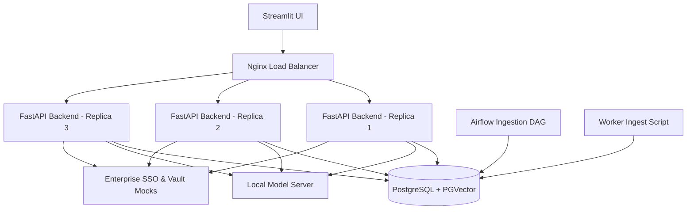

# Simple RAG System for HP Technical Support

An enterprise-ready Retrieval-Augmented Generation (RAG) system running entirely locally. It parses HP product manuals, indexes them into a vector database, and serves a Streamlit conversational chatbot backed by a local Large Language Model (LLM).

---

## 🏗️ Architecture Overview

The application is structured as a collection of microservices containerized via Docker Compose:



### 🧱 Components

*   **Database (PostgreSQL + PGVector)**: Stores relational chat history (conversations/messages) and acts as the vector database for document search and semantic caching.
*   **Model Server**: Exposes OpenAI-compatible endpoints (`/v1/chat/completions` and `/v1/embeddings`) serving **Llama-3.2-1B-Instruct** (via `llama-cpp-python`) and **bge-small-en-v1.5** embeddings.
*   **FastAPI Backend**: Orchestrates the RAG pipeline using LangChain. Implements:
    *   **Relational Chat History**: Conversational memory loaded/saved to Postgres.
    *   **Semantic Cache Layer**: Connects to PGVector to return cached answers for near-identical queries with non-blocking async checks (`run_in_threadpool`).
    *   **Background Pruning**: Asynchronously deletes expired cache entries (TTL) and enforces max capacity limits.
*   **Frontend (Streamlit)**: A clean chat interface supporting:
    *   SSO authentication check (mocked).
    *   Chat selection & management.
    *   **Soft Delete**: Flags chats to be hidden from the UI without losing historic logs.
*   **Airflow Ingestion**: Runs a document processor DAG that extracts PDF manuals from `/data`, chunks them via `RecursiveCharacterTextSplitter`, embeds them, and upserts them into `hp_manuals_collection`.
*   **Evaluations**: 
    *   *Locust*: Simulates high-concurrency requests against `/api/chat` using questions from the QA dataset.
    *   *Ragas*: Evaluates answer quality (Faithfulness, Answer Relevancy, Context Recall/Precision) using a local LLM judge.

---

## 🚀 Getting Started

### 📋 Prerequisites
*   Docker and Docker Compose installed.
*   `uv` or standard Python 3.10/3.11 environment.

### ⚙️ Quick Start (Docker Compose)
1.  Initialize and start all services:
    ```bash
    make start
    ```
2.  The application exposes the following interfaces on your host:
    *   **Streamlit Chatbot**: `http://localhost:8501`
    *   **Nginx Load Balancer (Backend API)**: `http://localhost:8000`
    *   **Apache Airflow**: `http://localhost:8080` (credentials: `admin`/`admin`)
    *   **Model Server API**: `http://localhost:9000` (OpenAI-compatible)
    *   **Enterprise Mocks**: `http://localhost:8001`
3.  To shut down the cluster:
    ```bash
    make stop
    ```

---

## 🧪 Development & Testing

We use `uv` and `pytest` for executing and managing backend, airflow, and worker tests.

### 🏃 Running Unit Tests
You can execute tests across all sub-modules using the root Makefile:
```bash
make test
```
Or run backend tests specifically:
```bash
cd backend
uv run pytest --cov
```

---

## 📊 Evaluation & Quality Benchmarking

Detailed instructions for evaluation can be found in the [Evaluation README](file:///home/matheus/Documents/simple_rag/evaluation/README.md).

### 📈 Load Testing
Run Locust load tests:
```bash
uv run locust -f evaluation/locustfile.py
```
Open `http://localhost:8089` to configure and start the stress tests.

### 🎯 Accuracy & Ragas Evaluation
Evaluate RAG accuracy metrics:
```bash
uv run python evaluation/benchmark_ragas.py --limit 5
```
This evaluates the pipeline against our `qa_dataset.json` questions using local judges and exports a report to `evaluation/rag_benchmark_report.csv`.
